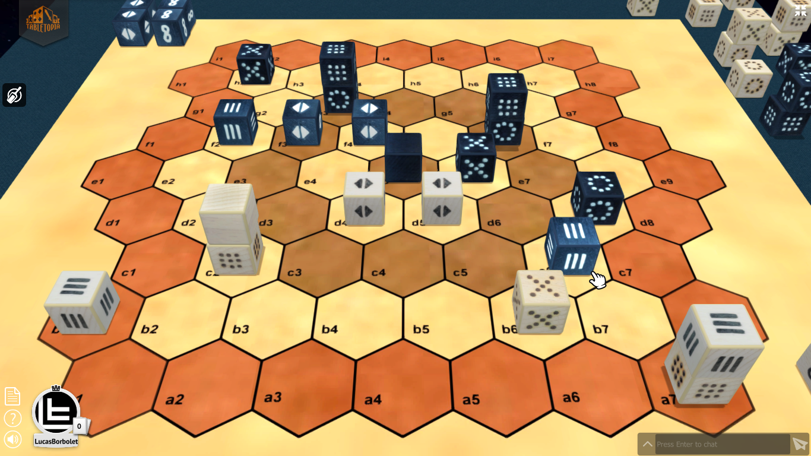

# JERSI

**Jersi** describes the rules of a **strategy game** for two players:

> The players embody two armies of cubes which compete on a game board. Each player must bring his king to the opposite edge of the board and thus win the war. The cubes move on the board or are parachuted from the players' reserves. Stacks of cubes move faster and capture from a greater distance than cubes alone. Beware of accelerations!

To get a taste of the game watch this 3 minutes video: [**JERSI 4.3 demo play**](https://www.youtube.com/watch?v=Cgo8AJnYCfA). To go further, move on [**Tabletopia**](https://tabletopia.com/) platform and test the game with your friend in the following  **[play zone](https://tabletopia.com/workshop/widget/jersi-ae2mkk/680x340)**.

Unless you are interested in the latest rules being under construction, it is better to read the released versions either in directory [**releases**](./releases) or at GitHub URL [**releases**](https://github.com/LucasBorboleta/jersi/releases).

Any *feedback* on the text or even on the game play is welcome!

The **roadmap** is  as follows:

1. Publish JERSI for free in the *Tabletopia* catalog.
2. Implement JERSI into an existing *AI engine*.
3. Launch a *Kickstarter* campaign to physically publish JERSI. 

If you intent to derive or to sell either a text, a product or a software from this work, then read the [**LICENSE**](./docs/LICENSE.md) document. 

Be aware that until JERSI v3.0 the applied license is CreativeCommons-BY-SA, but that the next versions do apply the license CreativeCommons-BY-NC-SA. 

