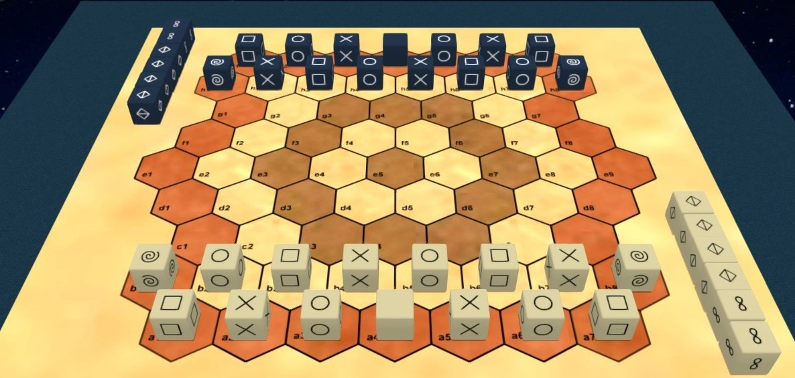

# jersi

JERSI describes the rules of a **strategy game** for two players:

> With the wise men of the Jersi universe you will cross mountains, but beware of fools! In this chess game where rock, paper and scissors fight each other, the goal is for your king to cross the field. You move each cubic piece either individually or by stacking it on top of another which then acts as a quick mount.

To get a taste of the game watch this 3 minutes video: [**JERSI demo play**](https://www.youtube.com/watch?v=Cgo8AJnYCfA). To learn the rules of the game: either read the rulebook document or watch this 11 minutes rulebook video: [**JERSI rulebook video**](https://www.youtube.com/watch?v=9613QXbaYjo) (also available in French). To go further, play the game with your friend on **[Tabletopia](https://tabletopia.com/games/jersi)** platform .

Jersi  is registered in the famous [**BoardGameGeek**](https://boardgamegeek.com) database under the [**ID 369835**](https://boardgamegeek.com/boardgame/369835/jersi), thanks to some unknown contributor.

Unless you are interested in the latest rules being under construction, it is better to read the released versions either in directory [**releases**](./releases) or at GitHub URL [**releases**](https://github.com/LucasBorboleta/jersi/releases).

For making yourself your own JERSI copy -- for non-commercial usage -- read the [**DIY**](./DIY.md) document.

Any *feedback* on the text or even on the game play is welcome!

The **roadmap** is  as follows:

- [x] Publish JERSI for free in the *Tabletopia* catalog.
- [x] Implement JERSI into an *AI engines* (minimax and MCTS ; see *jersi-certu* project at GitHub).
- [ ] Implement JERSI on Bord Game Arena.
- [ ] Find a publisher to physically publish JERSI. 

If you intent to derive or to sell either a text, a product or a software from this work, then read the [**LICENSE**](./docs/LICENSE.md) document. 

Be aware that until JERSI v3.0 the applied license is CreativeCommons-BY-SA, but that the next versions do apply the license CreativeCommons-BY-NC-SA. 

