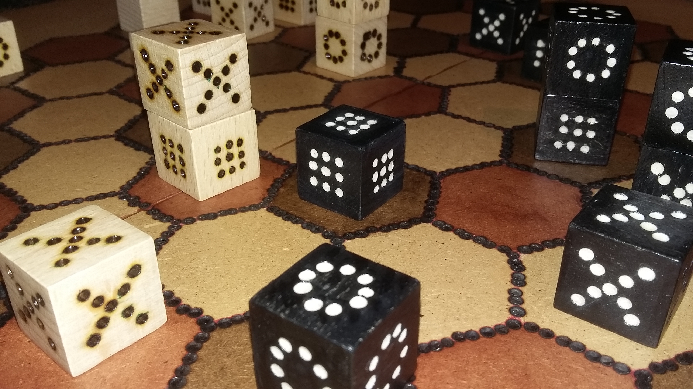

# JERSI

**Jersi** describes the rules of an **abstract game** for two players. Hereafter is an overview. See the rules for details.

If you intent to derive or to sell either a text, a product or a software from this work, then read the [**LICENSE**](./docs/LICENSE.md) document.

Your white shapes chase after your opponent's black in order to capture their unique black “**kunti**”, and vice versa. On the hexagonal board, stacks project your force and protect your forms from enemy threats. But not completely, because a ternary and cyclical order governs the forces. So, you will have to stack and unstack your shapes at the right time and in the right place!

